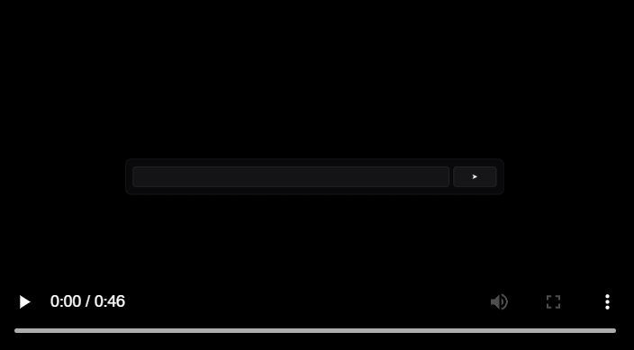

<div align="center">
  
</div>

<br/>

<div align="center">

[](https://ozioisgood.github.io/alfa/)
[](https://www.python.org/downloads/)

</div>

<br/>

# ALFA 🎬✨

**❓ Automated Learning Framework for Animation**

> Paste a problem. Get a short explainer video with narration and clean visuals. ✨

---

## Overview 🧭

ALFA turns a single educational problem into a concise video with narration and animated graphics.
It is designed for students, teachers, and self learners who prefer visual clarity over long lectures.
The pipeline writes a script, renders scenes with Manim, generates voice using cloud TTS, and stitches the final video.

Key ideas:
- One problem to one tidy video
- Visual first explanations with minimal clutter
- Simple local setup with optional Docker

---

## Demo ▶️
<div align="center">

[](assets/alfa.promo.v1.mp4)

</div>

---

## Features 🚀

- 🎯 Subject aware prompts for Math, Physics, Chemistry, and Computer Science
- 🎞️ Manim based animations with LaTeX support
- 🔊 Natural voice narration using Google Cloud Text to Speech
- 🎚️ Quality presets: 480p, 720p, 1080p, 4K
- 🌐 Gradio web UI for quick runs
- 🧩 CLI for batch jobs
- 🐳 Docker image for isolated rendering
- 🧾 Configuration through a simple `.env` file
- 🧠 Extensible prompt packs and scene templates

---

## Supported Subjects 📚

- 📐 Mathematics - equations, graphs, geometry, calculus, algebra
- 🧲 Physics - kinematics, forces, energy, circuits, waves
- 🧪 Chemistry - reactions, molecules, balancing, stoichiometry
- 💻 Computer Science - algorithms, data structures, complexity

---

## Requirements 🧰

- 🐍 Python 3.13 or newer
- 📦 UV package manager
- 🎬 FFmpeg in your PATH
- 🐳 Docker optional but recommended for reproducible rendering
- ☁️ Google Cloud credentials if you want TTS

---

## Quick start ⚡

Clone the repository and install dependencies:

```bash
git clone https://github.com/OZIOisgood/alfa.git
cd alfa
uv sync
```

Set up environment variables:

```bash
cp .env.example .env
# Edit .env and add your API keys
```

Launch the app:

```bash
uv run python run-gradio.py
```

Open the URL that Gradio prints. Paste a problem. Select a quality profile. Generate.

---

## Docker usage 🐳

Build the image:

```bash
docker build -t alfa-manim:latest .
```

Run the app inside Docker:

```bash
docker run -it --rm -p 7865:7865 \
  -v "$PWD/output:/app/output" \
  -v "$PWD/.credentials:/app/.credentials" \
  --env-file .env \
  alfa-manim:latest uv run python run-gradio.py
```

---

## Project structure 🗂️

```txt
alfa/
├─ apps/
│  ├─ gradio/               Web UI
│  │  ├─ main.py            Entry point
│  │  └─ prompts/           Subject specific prompts
│  └─ docs/                 Docusaurus site
├─ output/                  Rendered videos
├─ assets/                  Static assets and promo media
├─ .credentials/            API credentials, not committed
└─ run-gradio.py            Launcher
```

---

## How it works 🔧

1. Input - user submits a short problem statement
2. Plan - LLM drafts a script and a scene outline
3. Render - Manim renders scenes with math notation where needed
4. Voice - TTS generates a natural reading of the script
5. Compose - FFmpeg merges video and audio into a single file
6. Deliver - the final MP4 is stored in `output`

Design principles:
- Keep scenes short and legible
- Focus on the core idea and the answer path
- Prefer consistent pacing and typography

---

## Configuration ⚙️

ALFA reads settings from `.env`. Examples:

```env
OPENAI_API_KEY=your_key_or_empty
GOOGLE_APPLICATION_CREDENTIALS=/app/.credentials/key.json
VOICE_NAME=en-US-Standard-B
VIDEO_QUALITY=720p
SCENE_FPS=30
```

You can also set per run options in the UI or via CLI flags.

---

## CLI usage 💻

The CLI runs a single prompt to video job:

```bash
uv run python -m apps.gradio.main \
  --problem "Find the slope between points (2, 4) and (6, 12)" \
  --subject math \
  --quality 720p \
  --voice en-US-Standard-B
```

---

## Examples 🎓

Mathematics:

```text
Problem: Find the area of a circle of radius 5 cm
Output: 75 second clip with formula A = pi r^2, intermediate steps, and narrated answer
```

Physics:

```text
Problem: A ball is dropped from 45 m. Find time to impact
Output: free body diagram, kinematic formula, result with units
```

Chemistry:

```text
Problem: Balance CH4 + O2 -> CO2 + H2O
Output: molecule counts and balanced coefficients
```

Computer Science:

```text
Problem: Explain binary search on a sorted array
Output: step by step pointer animation with O(log n) summary
```

---

## Performance notes 📈

| Quality | Resolution | Typical render time | Approx file size |
|---------|------------|---------------------|------------------|
| Low     | 480p       | 2 to 3 min          | ~10 MB           |
| Medium  | 720p       | 4 to 8 min          | ~30 MB           |
| High    | 1080p      | 15 to 25 min        | ~150 MB          |
| Ultra   | 2160p      | 30 to 60 min        | ~500 MB          |

Numbers vary by scene complexity, font use, and LaTeX density.

---

## Troubleshooting 🩺

TTS produces a click at the start:
- Prepend 50 ms of silence in FFmpeg using `-af adelay`
- Verify your voice selection and sample rate

LaTeX errors during render:
- Ensure Manim LaTeX packages are available inside Docker
- Reduce nested TeX expressions or pre render complex parts as SVG

Long render times:
- Lower resolution or FPS
- Disable motion blur and shadows in templates

---

## Security and privacy 🔐

- Do not commit real keys. Use `.env` and `.credentials` only
- Review terms of your LLM and TTS providers
- Keep student data out of prompts unless you have consent

---

## Roadmap 🗺️

- More subject packs including Biology and Economics
- Parametric templates for common problem types
- Batch mode for classroom sets
- Pluggable TTS providers
- Rich theme system for typography and color